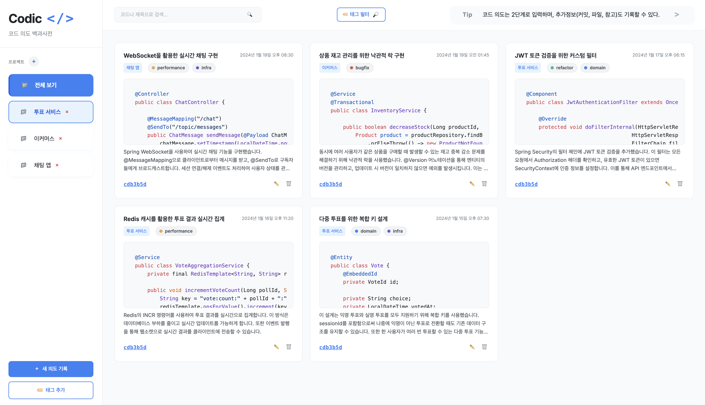
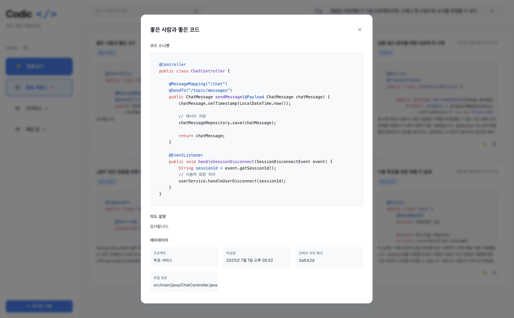

# Codic - 코드 의도 백과사전

개발자가 코드 스니펫과 함께 그 코드의 심층적인 의도, 배경, 관련 정보 등을 기록하고 공유할 수 있는 웹 애플리케이션입니다.

> 현재 API 호출, 데이터 저장 등이 구현되지 않은 프로토타입 버전입니다.

- 화면 어디서나 코드 스니펫을 붙여넣고 의도를 기록하세요.
- 자동으로 언어를 감지하고 코드 스니펫을 자동으로 붙여넣습니다.

- 최상단 프로젝트 혹은 선택된 프로젝트에 의도를 기록할 수 있어요.

- 저장된 의도를 검색하고 확인할 수 있어요.
- 코드 블럭을 클릭하여 코드 스니펫을 복사할 수 있어요.

## 🎯 프로젝트 개요

### 문제 정의

> **주니어 개발자**: 자신이 작성한 코드의 의도를 잊어버려 다시 분석하는 데 시간을 낭비
>
> **팀 개발자**: 팀원들이 작성한 코드의 의도를 파악하기 위해 추가적인 설명 및 이해하는 시간 필요
>
> **레거시 코드**: 시간이 오래된 코드의 원래 의도 파악 어려움

### 사용자는 어떤 문제를 겪고 있나요?

**주니어 개발자**

- 자신이 과거에 작성한 코드의 의도를 잊어버려 다시 분석하는 데 시간을 낭비합니다.
- 다른 팀원이나 오픈소스 프로젝트의 **코드를 이해하는 데 어려움**을 겪습니다.
- 복잡한 로직이나 비즈니스 규칙이 적용된 코드에 **주석을 달기 어렵거나**, 주석이 오히려 코드 가독성을 해칠까 봐 주저합니다.
- 에러 발생 시 특정 코드 라인의 **원래 의도를 파악하기 힘들어** 디버깅에 시간이 오래 걸립니다.

**시니어 개발자/팀 리더**

- 팀원들이 작성한 코드의 **의도를 파악하기 위해** 추가적인 설명 시간을 가져야 합니다.
- 코드 리뷰 시 주석만으로는 충분치 않은 **코드의 배경이나 맥락**을 파악하기 어렵습니다.
- 시간이 오래된 레거시 코드의 **유지보수 및 리팩토링 시** 원래 의도 파악에 어려움을 겪습니다.

### 해결책

코드 스니펫과 함께 그 코드의 심층적인 의도, 배경, 관련 정보 등을 기록하고 공유할 수 있는 `코드 의도 백과사전` 웹 애플리케이션

## 페르소나 정의

### 벨로 (주니어 개발자 페르소나)

- 나이 26세
- 직업/역할: 1년차 웹 백엔드 개발자
- 목표:
  - 내가 작성한 코드의 의도를 명확히 기록하여 나중에 다시 분석하기 쉽게 만들고 싶다. 나아가 이력서에 더욱 생생하게 작성하고 싶다.
  - 동료 코드의 복잡한 부분을 빠르게 파악하여 개발 시간을 단축하고 싶다.
  - 깔끔한 코드에 주석을 많이 달기보다는 코드의 배경 설명을 별도로 관리하고 싶다.
- 니즈:
  - 코드 스니펫과 함께 의도를 기록할 수 있는 간단하고 직관적인 인터페이스.
  - 커밋 해시, 파일 경로 등 코드의 실제 위치와 연결할 수 있는 기능.
  - 내가 기록한 의도들을 쉽게 검색할 수 있는 기능.
- 행동 패턴: 새로운 기술을 배우는 것에 적극적이며, 개인 블로그에 학습 내용을 정리하는 습관이 있습니다. 종종 작성했던 코드를 다시 보며 "이걸 왜 이렇게 만들었지?" 하고 다시 고민하는 일이 잦습니다.

### 슬링키 (팀 리더 페르소나)

- 나이 32세
- 직업/역할: 6년차 웹 풀스택 개발자, 팀 리더
- 목표:
  - 팀원들이 작성한 코드의 의도를 빠르게 파악하여 팀 개발 시간(또는 새로운 팀원 온보딩 기간)을 단축하고 싶다.
  - 코드 리뷰 시 주석만으로는 충분치 않은 코드의 배경이나 맥락을 파악하고 싶다.
  - 오래된 레거시 코드의 유지보수 및 개선 과정에서 원래 의도를 파악하는 데 드는 비용을 줄이고 싶다.
- 니즈:
  - 팀원들이 기록한 코드 의도들을 한눈에 볼 수 있는 대시보드.
- 행동 패턴: 팀의 생산성과 코드 품질 향상에 관심이 많으며, 코드 리뷰와 기술 공유 세션을 중요하게 생각합니다. 과거의 경험으로 미루어 볼 때 코드의 맥락이 제대로 공유되지 않아 발생하는 비효율을 줄이고 싶어 합니다.

## 사용자 시나리오

### 시나리오 1: 벨로가 자신의 코드 의도를 기록하고 활용하기

벨로는 최근 개발한 투표 서비스에서 다중 투표를 위해 투표 생성 부분을 복잡하게 구현했습니다. 나중에 이 코드를 다시 볼 때 잊지 않도록 “코드 의도 백과사전” 앱에 기록하기로 합니다.

1. 코드 스니펫 복사 및 붙여넣기 IDE에서 복붙
2. 의도 상세 기록하기 예를 들어, 이것은 추후 익명이 아닌 투표를 위해서도 열여둔 부분이다 처럼 자세히 의도를 서술합니다.
3. 메타 데이터 연결, 해당 코드의 커밋 해시나 파일 경로, 혹은 참고한 자료 등을 자유롭게 첨부합니다.
4. 나중에 활용, 2~3달 뒤 이력서에 쓸 때 내가 그렇게 모델링한 이유라던가, 아니면 리팩터링할 때 다시 내가 그때 작성했던 의도를 파악하여 빠르게 다음 작업을 이어나갈 수 있습니다.

벨로는 앱 덕분에 자신의 개발 경험이 체계적으로 쌓이고, 과거의 코드를 더 효율적으로 이해하고 활용할 수 있게 됩니다.

### 시나리오 2: 슬링키 팀 리더가 팀원의 코드 의도를 파악하기

슬링키 팀장은 신규 팀원인 벨로가 올린 Pull Request를 리뷰하던 중, 특정 유틸리티 함수의 로직이 이해하기 어려웠습니다. "코드 의도 백과사전" 앱을 활용해 보기로 합니다.

1. 슬링키는 Pull Request의 특정 코드 블록을 복사하여 앱에 붙여넣거나, 관련 파일 경로로 검색하여 김찬우가 기록한 해당 코드의 의도를 찾습니다.
2. 벨로가 "이 유틸리티 함수는 특정 레거시 시스템과의 데이터 호환성을 위해 불가피하게 이중 암호화를 적용한 부분입니다."라고 기록해 둔 것을 확인하고, 코드의 복잡한 배경을 이해하게 됩니다.
3. 슬링키는 해당 의도 기록에 "이 로직이 현재도 유효한지 재확인이 필요합니다. 레거시 시스템이 업데이트되었는지 확인 후 개선 여부를 논의해요."라는 코멘트로 오프라인 회의를 시작합니다.

## ✨ 주요 기능

### 1. 코드 의도 기록

- 코드 스니펫 복사 및 붙여넣기
- 의도 상세 기록 (배경, 이유, 고려사항)
- 프로젝트별 분류
- 태그 시스템
- 메타데이터 연결 (커밋 해시, 파일 경로, 참고 자료)

### 2. 검색 및 필터링

- 제목, 코드, 의도 설명으로 검색
- 프로젝트별 필터링

### 3. 관리 기능

- 의도 기록 편집
- 의도 기록 삭제
- 상세 보기 모달

**Codic** - 코드 의도 백과사전으로 더 나은 개발 경험을 만들어가세요! 🚀

## 사용법

1. **코드 의도 기록**
   - `새 의도 기록` 클릭 또는 `코드 붙여넣기(⌘+V/ctrl+V)` → 코드블럭 아래 textarea에 코드 입력
   - 우측 상단에서 언어 선택(자동감지/Java/JS/SQL 등)
   - ESC로 언제든 모달 닫기 가능
2. **프로젝트 추가**
   - 사이드바 + 버튼 클릭 → 프로젝트명/링크 입력
3. **2단계 추가정보**
   - 깃허브 커밋 해시, 파일 경로, 참고자료 입력(모두 선택 사항)
